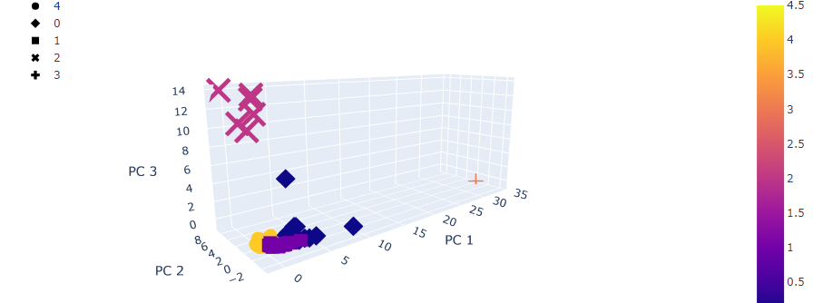
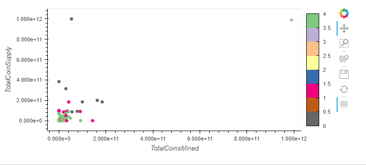

# Unsupervised_learning

Overview

The purpose of this project is to report a new cryptocurrency investment portfolio for an investment bank. The report includes cryptocurrencies that are on the trading market and if they can be grouped to create a classification system. In order to complete this project, an unsupervised machine learning functions are used on the data provided by CryptoCompare.

Results: 

Data preprossessing is performed to have cryptocurrencies that are actively trading, have a defined algorithm, and have a complete set of data. After the processing of the size of the dataset came to be a total of 533 different cryptocurrrencies. 

A three dimisional scatter plot shows how the different cryptocurrencies are clustered together. Each point includes its name as well as the algorithm used to create the currency.

Tradable Cryptos

In order to demonstrate the relationship between total coin supply and total coins mined, a two dimensional graph is created.   

Summary:

While looking at the three dimisional graph, one can see that there are five different clusters. Two groups are clumped very closely together with most currencies falling into one of these two groups. One group has a few different currencies that are farther away from the others and then there are other groups that only have few currencies. This shows that there are lot of currencies that perform similarly while there are a few that are outliers. These outliers could be over performers or under performers, a further analysis is needed. 

Looking at the plot on the total coins supply vs total coins mined, two major groups have most of their data points scattered within 0 to 40 percent of the largest currency by volume. Group of cryptos with few currencies are pretty close to 0 whereas one of the currency is at 100 percent level as it is the largest currency by volume.

